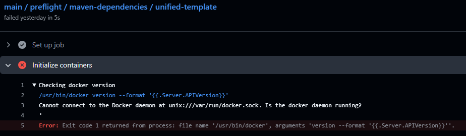
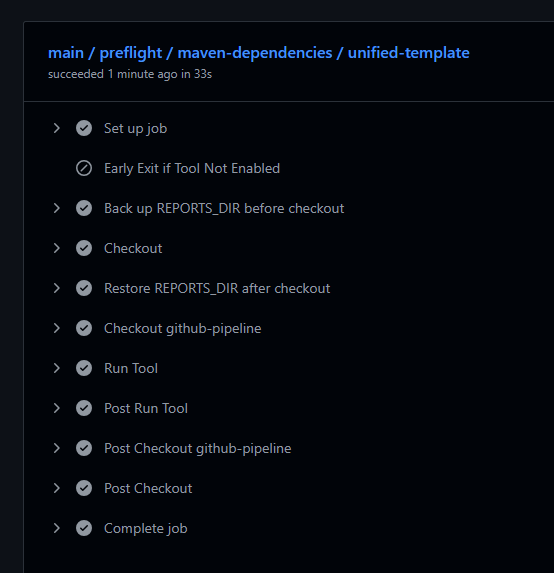

# SELF HOSTED RUNNER IN ARGO CD

We have developed a self-hosted runner deployed via Argo CD. However, when we try to use it in a pipeline that specifies **container**:, it fails at that step.



This happens because the runner’s container is isolated and cannot access anything on the host even Docker-in-Docker (DinD). The DOCKER_HOST inside the runner does not have access to the socket mounted in the runner pod, because that socket is not mounted inside the container that executes the job.

A Kubernetes-based runner with DinD cannot support workflows that use the ``container:`` directive if the job relies on the Docker CLI.  

When we write: 
```yml
``container:``
    image: my/image
```   
we're telling GitHub Actions to run the entire job inside the my/image container. During the Initialize job phase, the runner tries to execute:  
```
    docker run my/image
```

Self-hosted runners on Kubernetes do not support ``container:`` in workflows generically unless the runner is explicitly designed to handle it.  

When we remove ``container:``, it works perfectly:
  

**Options:**
* Remove ``container:``  from the workflow.
* Use actions-runner-controller
* Use a VM-based runner

## Solution
After careful consideration of the available options, we chose to implement actions-runner-controller (ARC) as our solution.

ARC is a Kubernetes operator that automates the deployment and management of self-hosted GitHub Actions runners in a Kubernetes cluster. This approach provided a robust and scalable way to manage our runners, and critically, it addressed the challenges we faced with Docker-in-Docker (DinD) when using the "container:" directive in our workflows.

By leveraging ARC, we were able to configure our runners in a way that properly handles the Docker daemon and its associated sockets within the Kubernetes environment. This allowed our workflows to successfully execute steps that utilize the "container:" directive, effectively resolving the DOCKER_HOST access issues and the inability to run docker run my/image commands from within the job container. ARC's design supports the complexities of running containerized workloads on Kubernetes, making it the ideal choice for our self-hosted runner deployment with Argo CD.