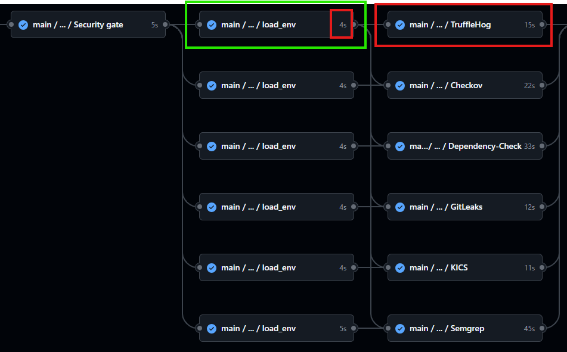
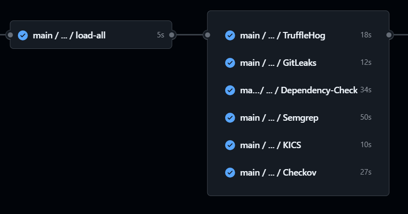

# Environment Variables

We found several issues when attempting to load the necessasary environment variables for each security tool. Our initial idea was to use separate environment files for each tool, such as trufflehog.env or gitleaks.env to manage their configuration. This approach allows the client to update the variables without needing to understand or modify the pipeline code.
However, we encountered several challenges with this method. In this document, we present the different strategfies considered, along wioth their respective issues, advantages and disadvantages.

## 1. Loading Variables from Individual Environment Files 1 by 1

In this case, we create a specific environment file for each tool. For example, the `trufflehog.env` file contains:  
```
    SEC_TOOL_NAME=TRUFFLEHOG
    JOB_NAME=trufflehog
    IMAGE=trufflesecurity/trufflehog:3.88.18
    COMMAND="filesystem src --debug --no-verification --json >"
    BIN=/usr/bin/trufflehog
    EXTRA_ARGS=
    SCAN_TYPE="Trufflehog Scan"
```
We load the environment file in the pipeline like this:  
```yaml
 load-trufflehog:
    uses: ./.github/workflows/load_variables.yml
    needs: security-gate
    with:
    default-filename: "trufflehog-default.env"
    filename: "trufflehog.env"
```
This method requires loading each file before using the corresponding tool. As a result, we expend additional time (around 5 seconds per tool), which becomes significant as we scale. It also introduces code duplication.  
We load the variables in separate steps because we use **generic variables names** as `IMAGE` or `COMMAND` instead of tool-specific names like `TRUFFLEHOG_IMAGE`. This means **we cannot load multiple files at once**, since doing so would **overwrite** the same variables repeatedly. To avoid this, we load each file in a separate job and then access the variables later using the format `tool_name.VARIABLE`.  
  
Here is an example of how we use these variables in a tool job:  
```yaml
# TruffleHog
trufflehog:
    name: "TruffleHog"
    needs: 
    - load-trufflehog
    - load-global
    runs-on: self-hosted
    container:
    image: ${{ needs.load-trufflehog.outputs.image }}
    steps:
    - name: Run TruffleHog
        uses: ./github-pipeline/.github/workflows-lib/security/template
        with:
        script: |
            ${{needs.load-trufflehog.outputs.bin}} ${{needs.load-trufflehog.outputs.command}} \
            REPORTS_DIR/${{needs.load-trufflehog.outputs.job_name}}.${{needs.load-trufflehog.outputs.format}} \
            ${{needs.load-trufflehog.outputs.extra_args}}
        report_name: ${{ needs.load-trufflehog.outputs.job_name }}.${{ needs.load-trufflehog.outputs.format }}
        scan_type: ${{ needs.load-trufflehog.outputs.scan_type }}
```

Here is a visual example of the workflow structure for this approach:  


## 2. Loading Variables from Individual Environment Files all at once
We could use a loop to load all the `.env` files as done in the previous approach, but using dynamic outputs. However, GitHub Actions does not support dynamically named outputs at runtime. Therefore, this option is not practicable.  
  
Another option, would be to combine all the environment files into a single script and load them together. However, in this case, we would need to consolidate all `.env` files into one, and then process that file to load the variables. This introduces two problems:
1. We would still have to define **one output for each variable** we want to use.
2. If a user wants to use a new tool, they would be forced to **modify the reusable workflow** itself to include new outputs, increasing code duplication and reducing scalability.  
Below is the `load_variables.yml` file, where we would need to manually define **all the outputs**:
```yml
on:
    workflow_call:
        inputs:
            default-filename:
                type: string
                required: true
            filename:
                type: string
                required: false
        outputs:
            trufflehog_sec_tool_name:
                value: ${{ jobs.load_env.outputs.trufflehog_sec_tool_name }}
            trufflehog_job_name:
                value: ${{ jobs.load_env.outputs.trufflehog_job_name }}
            gitleaks_sec_tool_name:
                value: ${{ jobs.load_env.outputs.gitleaks_sec_tool_name }}
            gitleaks_job_name:
                value: ${{ jobs.load_env.outputs.gitleaks_job_name }}
            
            ...

jobs:
    load_env:
        runs-on: "self-hosted"
        outputs:
            sec_tool_name: ${{ steps.load.outputs.SEC_TOOL_NAME }}
            job_name: ${{ steps.load.outputs.JOB_NAME }}
            image: ${{ steps.load.outputs.IMAGE }}
            ...
        steps:
            - name: Sobrescribir con variables específicas
              id: load
              run: |
                set -a
                if [ -f "github-pipeline/env/${{ inputs.default-filename }}" ]; then
                    . github-pipeline/env/${{ inputs.default-filename }}
                fi
                if [  -n "${{ inputs.filename }}" ] &&  [ -f ".github/workflows/env/${{ inputs.filename }}" ]; then
                    . .github/workflows/env/${{ inputs.filename }}
                fi
                set +a
 
                echo "SEC_TOOL_NAME=$SEC_TOOL_NAME" >> "$GITHUB_OUTPUT"
                echo "JOB_NAME=$JOB_NAME" >> "$GITHUB_OUTPUT"
                echo "IMAGE=$IMAGE" >> "$GITHUB_OUTPUT"
                ...
```
As seen above, this solution requires us to predefine all the possible outputs. Since GitHub Actions does not allow dynamically generating output names, this approach becomes redundant and difficult to maintain or scale. Therefore, we do not further explore this option, as it does not provide a better approach compared to the one discused previously.  

## 3. Loading Variables from Individual Environment Files all at once using JSON
In this approach, due to the failure of the previous method, we decided to use a JSON file to load all the variables at once. What we do is iterate over all the environment files located in the `env` directory, and for each one, we read its contents and save the variables into a single JSON file called `all_tools.json`. Each tool's variables are grouped under its `tool_name`, allowing us to store all tools' configurations separately but within the same JSON structure.  
The process is implemented as follows:  
```yaml
    load-all:
      runs-on: self-hosted
      needs: security-gate
      outputs:
        config: ${{ steps.collect.outputs.config }}
      steps:
        - name: "Read all the .env files and convert to JSON"
          id: collect
          run: |
              to_json() {
                local file="$1"
                local tool_name="$2"
                echo "\"$tool_name\": {"
                grep -v '^#' "$file" | grep '=' | while IFS='=' read -r key value; do
                  key=$(echo "$key" | tr -d ' ')
                  value=$(echo "$value" | sed 's/^"\(.*\)"$/\1/') # remove quotes
                  echo "\"$key\": \"$value\","
                done | sed '$ s/,$//'
                echo "}"
              }

              echo "{" > all_tools.json

              first=1
              for file in .github/workflows/env/*.env; do
                tool_name=$(basename "$file" .env)
                if [ "$first" -eq 0 ]; then
                  echo "," >> all_tools.json
                fi
                to_json "$file" "$tool_name" >> all_tools.json
                first=0
              done

              echo "}" >> all_tools.json

              config_json=$(cat all_tools.json | jq -c .)
              echo "config=$config_json" >> $GITHUB_OUTPUT
```
After that, each job uses the variables as shown below:  
```yaml
  # TruffleHog
    trufflehog:
      name: "TruffleHog"
      needs: 
        - load-all
      runs-on: self-hosted
      container:
        image: ${{ fromJson(needs.load-all.outputs.config).trufflehog.IMAGE }}
      steps:
        - name: Run TruffleHog
          uses: ./github-pipeline/.github/workflows-lib/security/template
          with:
            script: |
                ${{ fromJson(needs.load-all.outputs.config).trufflehog.BIN }} \
                ${{ fromJson(needs.load-all.outputs.config).trufflehog.COMMAND }} \
                REPORTS_DIR/${{ fromJson(needs.load-all.outputs.config).trufflehog.JOB_NAME }}.json
            report_name: ${{ fromJson(needs.load-all.outputs.config).trufflehog.JOB_NAME }}.json
            scan_type: ${{ fromJson(needs.load-all.outputs.config).trufflehog.SCAN_TYPE }}
```
This solution was the one chosen because it significally reduces duplication and repetition. It also improves scalability and reduces time. To add a new tool, you simply create a new .env file and a corresponding job.
  
Here is a visual example of the workflow structure for this approach:  
